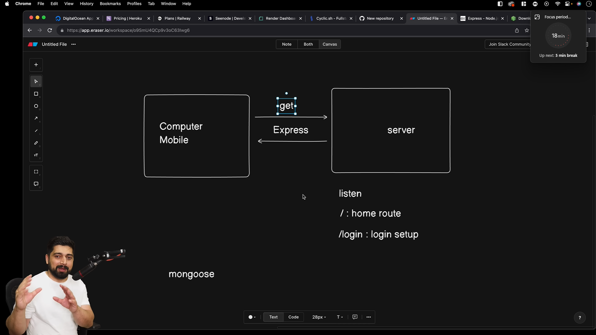

Make a empty node application

```bash
npm init
```

## Install express using

```bash
npm install express
```

## Install dotenv using and read about dotenv on its website

```bash
npm i dotenv
```

> Visit
> https://www.npmjs.com/package/dotenv
